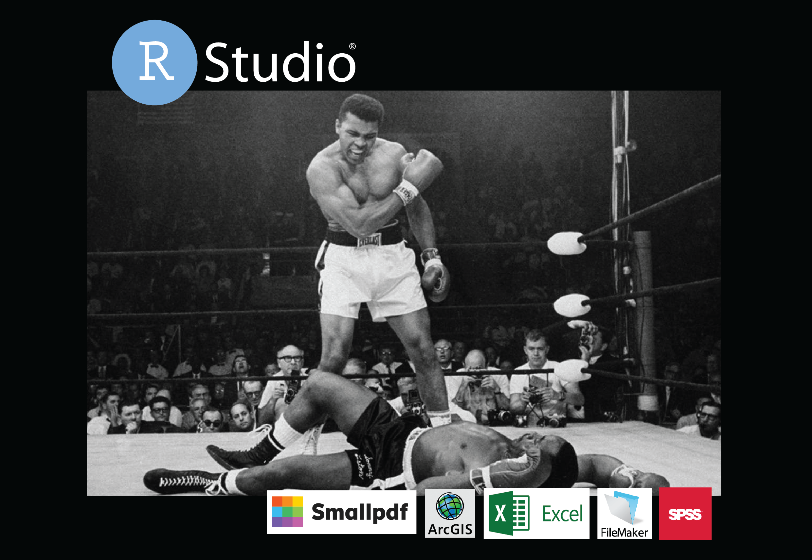

#  R pour les aRchéologues

Ce dépôt contient les tutoriels, scripts et données nécessaires pour suivre le workshop "R pour les aRchéologues" organisé par A. Vignoles et A. Hermann au sein de l'UMR 8068 en Avril 2023.

- [Débuter avec R et RStudio](debuter_avec_R.rmd)  
- [R et archéologie : les ressources en ligne](ressources-en-ligne.rmd)  

- [seance 0 : Pré-requis](seance-0_pre-requis.rmd)
- [Séance 1 : Se familiariser avec R](seance-1.html)
- [Séance 2 : Analyser et visualiser un jeu de données semi-quantitatif]()

### License
[CC BY-NC 4.0](https://creativecommons.org/licenses/by-nc/4.0/)
