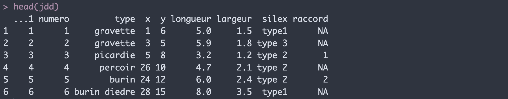
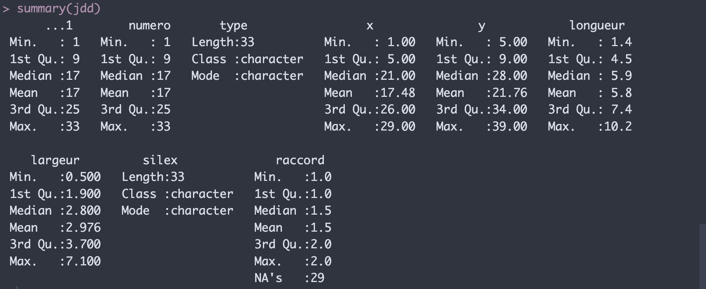
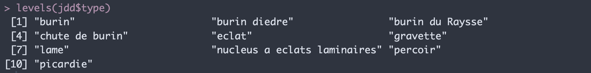
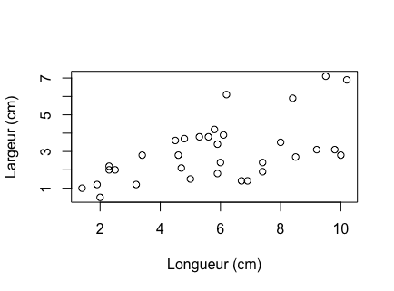
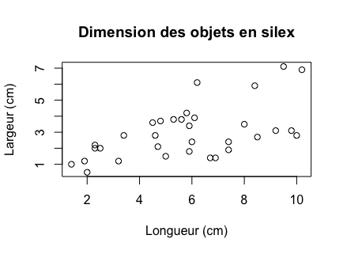
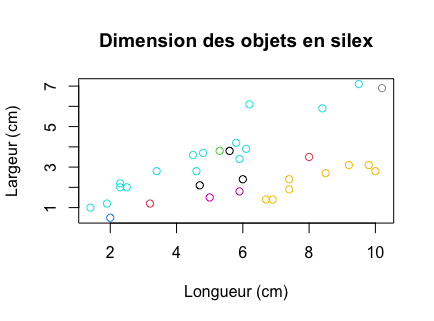
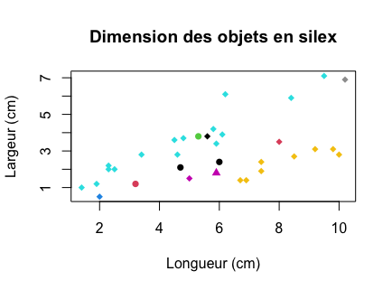
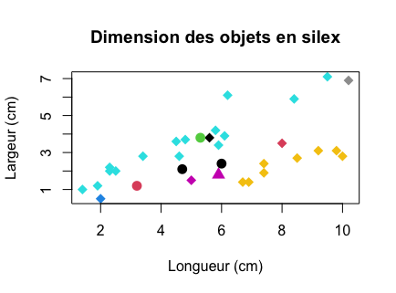

# Séance 1 : Se familiariser avec R

### 1-Introduction

Dans cette introduction, nous allons decouvrir les bases du langage de programmation R.  
Tout d'abord, tout le texte précédé par le signe dièse est ce qu'on appelle un commentaire. 
```{r}
# commentaire
```
Ce sont des lignes qui ne seront pas exécutées par le code et qui nous permettrons de décrire les étapes du script.
Bien commenter son code est très important car cela nous permet de le comprendre facilement méme après des mois et des années sans y avoir travaillé (en théorie !).
Cela nous permet aussi de le partager avec d'autres personnes, pour qu'elles comprennent tout de suite notre démarche.  


Nous allons travailler ici avec un jeu de données fictif appelé `Data_exemple`.  
Il s'agit d'un tableau décrivant plusieurs données qualitatives, quantitatives et spatiales de l'industrie lithique d'une collection.


### 2-Ouvrir un jeu de données

Nous allons commencer par ouvrir le jeu de données `Data_exemple` en utilisant le bouton `Import dataset` dans l'onglet `Environnement` en haut à droite:  

1- Choisir le fichier dans le répertoire avec le bouton `browse`:  

<code>.../GitHub/R-pour-archeologues/data/Data_exemple.xlsx</code>

2- Dans cette même fenêtre dans la section `import options` il est possible de spécifier le nom du jeu de données qui sera stocké dans R: appelez le "jdd".  

Cette procédure permet d'écrire automatiquement le code pour importer un tableau excel.  
Nous verrons ensuite comment importer des données avec une ligne de code directement, ce qui est plus reproductible.  

Vous venez d'ouvrir le tableau dans R ! Il a été stocké dans un objet que l'on a appelé `jdd`. Si vous l'appelez dans la console, il s'affichera et vous pourrez l'explorer.
```{r}
jdd
```

Il est également possible d'ouvrir le jeu de données en cliquant sur la ligne `jdd`, située la section `Data` du panneau en haut à droite (onglet `Environment`).  
Afin de ne pas encombrer la console, il est aussi possible de n'afficher que les 6 premiéres lignes du tableau avec la commande `head()`
```{r}
head(jdd)
```



### 3-Explorer un jeu de données

On peut vérifier la classe d'objet de `jdd` avec la commande suivante
```{r}
class(jdd)
```

Un data frame est un type d'objet R correspondant à un tableau. Il existe plusieurs classes que nous découvrirons au fur et à mesure.  
`class()` est **une fonction**. C'est une opération qui sera appliquée à un objet. La fonction `class()` permet d'afficher la classe de l'objet auquel on applique cette fonction. Lorsque l'on ne comprends pas l'objectif d'une fonction ou que l'on a oublié, on peut demander de l'aide par la fonction `help()` ou plus simplement à `?class` ou encore `help(class)`. Notez que ces deux commandes ont le méme résultat.

A présent on souhaite obtenir des informations statistiques générales sur les différentes dimensions du tableau. On utilise la fonction `summary()`
```{r}
summary(jdd)
```


On peut obtenir des informations basiques telles que le min/max/moyenne etc de chaque variable de classe numérique.  
On peut aussi afficher certaines informations sur les dimensions du tableau, comme le nombre de colonnes et de lignes
```{r}
nrow(jdd) # nb de lignes
ncol(jdd) # nb de colonnes 
```

Pour vérifier le type de variable dans un tableau (ce sera important car certaines fonctions nécessitent un type de variable particulier), on peut appliquer la fonction `class()` sur chaque variable séparément par l'opérateur `$`
```{r}
class(jdd$type)
class(jdd$longueur)
```

La variable `longueur` est de classe numérique tandis que la variable `type` est de classe `character`. Or, pour traiter des variables catégorielles avec R il vaut mieux utiliser le format `factor`. Nous allons donc convertir la variable `type` en facteur avec la fonction `factor()`.
```{r}
jdd$type <- factor(jdd$type) 
# cette commande signifie au pied de la lettre : 
# dans la colonne "type" du data frame "jdd", je  
# mets la colonne "type" du data frame "jdd" 
# converti en facteur
```

On vérifie que le code a bien fonctionné avec class()
```{r}
class(jdd$type)
```
NB : généralement quand on modifie les données primaires, il vaut toujours mieux créer une nouvelle colonne afin de garder une trace des données brutes. On aurait pu faire quelque chose comme cela :
```{r}
jdd$type_fac <- as.factor(jdd$type)

class(jdd$type_fac) # même résultat !
```

Nous pouvons à présent vérifier les différentes valeurs que peut prendre une variable catégorielle, par la fonction `levels()`
```{r}
levels(jdd$type)
```



Ces quelques fonctions sont utiles pour explorer les données et se rendre compte d'erreurs à un stade préliminaire.

#### 4-Créer un graphique simple 

A présent, essayons de visualiser un graphique de la longueur vs la largeur des pièces. Dans le R de base, on utilise la fonction `plot()`
```{r}
plot(x = jdd$longueur, y = jdd$largeur)
```
Ici, à l'intérieur de la fonction, on a précisé quels arguments étaient concernés. Un argument est un objet que l'on passera à la fonction pour qu'elle s'éxecute. Les fonctions comme `class()`, `levels()` n'ont qu'un argument, c'est pourquoi nous n'avons pas eu besoin de le préciser.  
De façon générale, les arguments sont rentrés dans l'ordre chronologique dans lequel ils sont programmés dans la fonction. Voyons voir cela de plus près. 
```{r}
?plot
```
Dans la fiche d'aide, nous pouvons voir que cette fonction nécessite deux arguments au minimum :  
`x` (abscisse) et `y` (ordonnée).  
Il est possible de préciser ou non dans le code quels objets vont dans quels arguments, mais ce n'est pas nécessaire si l'on respecte l'ordre `x` puis `y`.  
Ainsi, la commande suivante aura le même résultat que précédemment 
```{r}
plot(jdd$longueur, jdd$largeur)
```


Notez ici l'importance de bien séparer chaque argument par une virgule `,` pour ne pas créer d'erreur.  

Si la fonction `plot()` nécessite ces deux arguments pour fonctionner, nous pouvons lui transmettre d'autres arguments annexes permettant d'améliorer la qualité graphique. Par exemple, modifions un peu le titre des axes pour que ce soit plus clair:
```{r}
plot(x = jdd$longueur, y = jdd$largeur,
     xlab = "Longueur (cm)", ylab = "Largeur (cm)") 
# oui, il est possible de sauter une ligne avant de fermer la parenthèse !
```


Précisons ici que les textes entre guillemets ("" ou '') seront automatiquement considérés comme des objets de type caractère. Il est d'ailleurs possible de les définir avant de les inclure dans la fonction:
```{r}
xlabel <- "Longueur (cm)"
ylabel <- "Largeur (cm)"
```
et de les afficher
```{r}
xlabel
ylabel

plot(x = jdd$longueur, y = jdd$largeur,
     xlab = xlabel, ylab = ylabel)

# Ajoutons également un titre
title <- "Dimension des objets en silex"

plot(x = jdd$longueur, y = jdd$largeur,
     xlab = xlabel, ylab = ylabel, 
     main = title)
```


Pour aller plus loin dans l'analyse, il est possible de colorer les points en fonction d'une catégorie.  Voyons par exemple ce que cela donne avec la catégorie `type_fac`
```{r}
plot(x = jdd$longueur, y = jdd$largeur,
     col = jdd$type_fac, 
     xlab = xlabel, ylab = ylabel,
     main = title)
```


On peut également changer la forme des points avec l'argument `pch`. Essayons de faire un graphique avec des formes différentes en fonction du type de silex.
NB : N'oublions pas de convertir notre colonne silex en facteur !
```{r}
jdd$silex_fac <- as.factor(jdd$silex)

plot(x = jdd$longueur, y = jdd$largeur,
     col = jdd$type_fac, 
     pch = c(16, 17, 18)[as.numeric(jdd$silex_fac)], # ici, on assigne les formes
                                                     # 16, 17 et 18 aux levels  
     xlab = xlabel, ylab = ylabel, 
     main = title)
```


Les points de ce graphe sont trop petits pour être bien visibles. Mais bien sûr il est possible de modifier leur taille au sein de la fonction `plot()`. 
```{r}
plot(x = jdd$longueur, y = jdd$largeur,
     col = jdd$type_fac, 
     pch = c(16, 17, 18)[as.numeric(jdd$silex_fac)],  
     cex = 1.5,
     xlab = xlabel, ylab = ylabel, 
     main = title)
```


Il existe plusieurs moyens pour enregistrer une figure:  
- Le premier est de cliquer sur le bouton `Export` dans l'onglet `Plots`. Vous pouvez alors choisir le dossier dans lequel sauvegarder la figure, dont vous pouvez modifier les dimensions manuellement.  
- Toutefois, il est parfois utile de sauvegarder directement la figure avec une ligne de code, notamment dans le but de réaliser plusieurs figures similaires de la même taille exactement ! Utiliser la fonction `pdf()` est plus reproductible et ne complique par le code outre mesure.  

Enregistrons notre figure au format pdf de cette manière:
```{r}
#Il faut tout d'abord créer un fichier pdf vide de la taille voulue
pdf("figures/Figure1.pdf",        # ici on écrit le chemin vers la figure
     width = 4.5, height = 4.5)   # et ici les dimensions de la figure en cm. 

### On écrit la figure dans le pdf
plot(x = jdd$longueur, y = jdd$largeur,
     col = jdd$type_fac, 
     pch = c(16, 17, 18)[as.numeric(jdd$silex_fac)], 
     cex = 1.5,
     xlab = xlabel, ylab = ylabel, 
     main = title)

### et on clôture l'écriture de la figure dans le pdf

dev.off()
```

**FELICITATIONS ! Vous avez fait vos premiers pas sur R !!**
